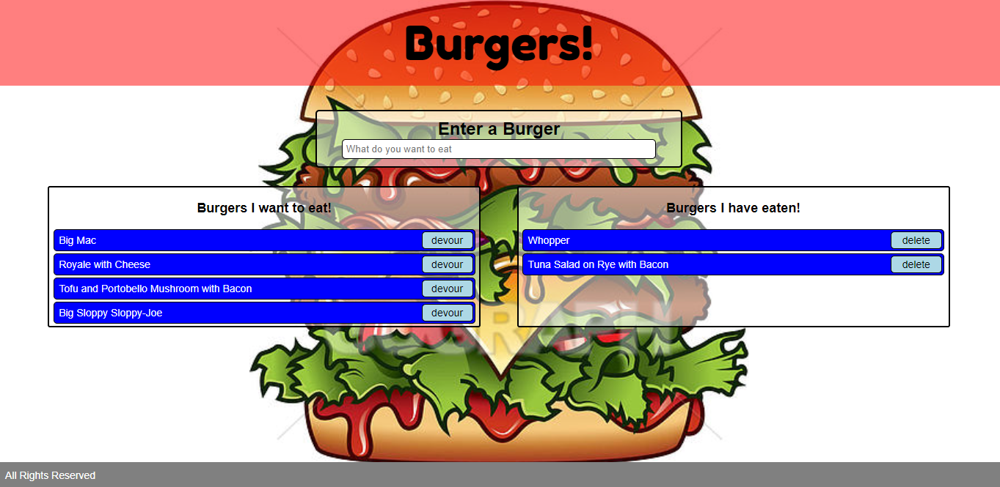

# Burgers

Burgers is a full stack Node.js application written with ExpressJS and using Express-Handlebars and MySQL.  It implements a Model-View-Controller (MVC) paradigm that create multiple layers of abstraction.  It also uses Object-Relational Modeling (ORM), another abstraction, to interact with the database.

It's a simple application, basically a "burger to do list".  Users enter a "burger" they would like to eat, and are able to track and manage the wish list with "devour" and "delete" buttons for each entry.

[Have a look](https://bmccutchanjr-burgers.herokuapp.com) or watch the [video](https://drive.google.com/file/d/1onIz9hobYicptweNtew0LWa7_f_tZ4h8/view).

## M-V-C

Model View Controller is a design paradigm that separates the main functional requirements of an application into discrete modules.  These modules create layers of abstraction that simplify the code of the other modules.  The Controller doesn't have to interact with the database and the Model doesn't have to implement the routes.  Each module is focused on its own functionality and passes data back and forth.

The project is structured in several folders.

### The Model

Models implement the server-side logic of an application, in this case `models/burgers.js` and `config/orm.js`.  Because this is a simple to-do list style application, `burgers/js` has very little to do.  Most of the logic revolves around database access and is implemented in `orm.js`.

### The View

Views are the User Interface, responsible for displaying data in a user-friendly manner and allowing users to interact with and navigate the application.  With a web page, the View is implemented with HTML, CSS and JavaScript.

### The Controller

The Controller controls flow on the server (the routes) and is implemented in `server.js` and `controllers/burger-controller.js`.

## Object-Relational Modeling

ORM is an additional level of abstraction that handles the applications interaction with a database, in this case a MySQL relational database.